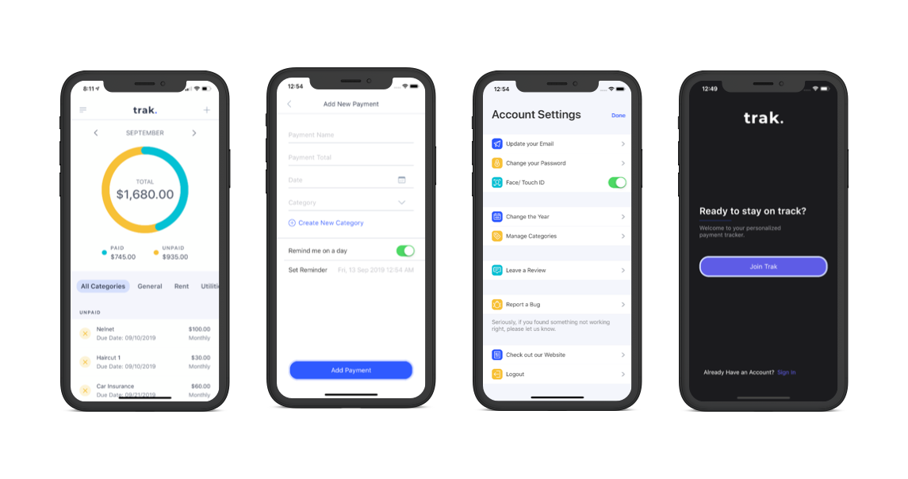

# Trak Expense Management App
> Trak is an expense management app that puts the power of controlling your finances back into the hand's of the user.
>
> Currently in Beta and not yet released.

[![Swift Version][swift-image]][swift-url]

Most financial apps simply display what you've paid by connecting to your bank account, but, Trak gives you the power to control your finances.

Easily log your monthly expenses, bills, and payments and keep track of what you've paid and what you have left.

You can easily filter your expenses by category to have a better idea of what you're spending.

## Features

- [x] Updates in Real Time
- [x] No Bank Account Connection
- [x] Easily Swipe to Mark as Paid/ Delete
- [x] Edit and Expenses at any Time
- [x] Custom Loading/ Animations

## Requirements

- iOS 11.3+
- Xcode 11.0

## Technologies

- Dark Mode
- XCode 11
- UIKit
- Swift 5
- UITableView
- UIStackView
- SF Symbols

## Contact

Ben Patterson – benjpatt48@gmail.com

Personal Website - [https://benjpatt.com](https://benjpatt.com/)

Find My GitHub - [https://github.com/benpatterson48](https://github.com/benpatterson48)

[swift-image]:https://img.shields.io/badge/swift-5.0-orange.svg
[swift-url]: https://swift.org/
